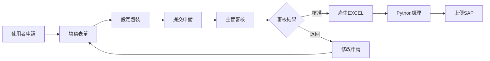

# 物料編碼申請管理系統 V3.5 - 檔案清單

## 📁 系統檔案總覽

### 🌟 核心系統檔案

| 檔案名稱 | 類型 | 說明 | 大小 |
|---------|------|------|------|
| `material_system_v3.5_complete.html` | HTML | 主系統檔案（包含所有功能） | ~95KB |
| `excel_processor.py` | Python | EXCEL處理程式 | ~15KB |
| `README_V3.5.md` | Markdown | 完整系統說明文件 | ~18KB |
| `QUICKSTART_V3.5.md` | Markdown | 快速啟動指南 | ~8KB |

### 📊 參考檔案（專案目錄）

| 檔案名稱 | 說明 | 用途 |
|---------|------|------|
| `40081_產品型號編碼總表.xlsx` | 編碼規則定義 | 料號產生規則參考 |
| `項目主檔ITOM.xlsx` | SAP欄位結構 | 欄位對照參考 |
| `包裝說明_建置_項目主檔.xlsx` | 包裝類別定義 | 包裝說明結構 |

### 📥 上傳檔案（使用者資料）

| 檔案名稱 | 說明 | 用途 |
|---------|------|------|
| `料件包裝說明_僅中文分類.xlsx` | 包裝說明範例資料 | 預設選項參考 |
| `20251103_SAP料品申請表.xlsx` | SAP格式範本 | EXCEL格式參考 |
| `包裝說明項目主檔.xlsx` | 包裝項目主檔 | 包裝分類參考 |

---

## 🚀 快速開始步驟

### 1️⃣ 基本使用（不需Python）
```
1. 開啟 material_system_v3.5_complete.html
2. 開始使用系統
3. 匯出CSV檔案
```

### 2️⃣ 完整功能（含EXCEL處理）
```
1. 安裝Python 3.8+
2. pip install pandas openpyxl xlrd
3. 開啟 material_system_v3.5_complete.html
4. 使用系統產生申請
5. 執行 python excel_processor.py 處理檔案
```

---

## 📋 功能對照表

| V3.4 功能 | V3.5 新增 | 狀態 |
|----------|----------|------|
| 物料申請 | ➕ 包裝說明7類別 | ✅ 完成 |
| 審核流程 | 保持原功能 | ✅ 完成 |
| 查詢功能 | 保持原功能 | ✅ 完成 |
| SAP API | ➡️ EXCEL匯出 | ✅ 完成 |
| 編碼產生 | 保持原功能 | ✅ 完成 |
| - | ➕ Python處理器 | ✅ 完成 |
| - | ➕ 八大類格式 | ✅ 完成 |
| - | ➕ 包裝模板 | ✅ 完成 |

---

## 🔄 系統流程圖



---

## 💾 資料儲存說明

### LocalStorage 結構
```javascript
{
    "applications": [],      // 申請資料
    "codeCounter": {},      // 流水號計數
    "packagingTemplates": {},// 包裝模板
    "systemSettings": {}    // 系統設定
}
```

### EXCEL 輸出格式
- **檔名格式**：`SAP_Material_Export_{類別}_{日期}.csv`
- **編碼**：UTF-8 with BOM
- **分隔符號**：逗號(,)
- **文字限定符**：雙引號(")

---

## 🛠️ 技術規格

### 前端技術
- HTML5 + CSS3
- 原生 JavaScript (ES6+)
- LocalStorage API
- File Download API

### Python需求
- Python 3.8+
- pandas >= 1.3.0
- openpyxl >= 3.0.9
- xlrd >= 2.0.1

### 瀏覽器支援
- Chrome 90+
- Edge 90+
- Firefox 88+
- Safari 14+

---

## 📝 版本歷程

| 版本 | 日期 | 主要更新 |
|------|------|----------|
| V3.5 | 2024.11.22 | 包裝說明模組、EXCEL整合 |
| V3.4 | 2024.10.15 | ITOM架構整合 |
| V3.3 | 2024.09.20 | 審核流程優化 |
| V3.2 | 2024.08.10 | SAP欄位對應 |
| V3.1 | 2024.07.05 | 編碼規則更新 |
| V3.0 | 2024.06.01 | 系統初版 |

---

## 📞 支援資訊

### 問題回報
請提供以下資訊：
1. 系統版本（V3.5）
2. 瀏覽器版本
3. 錯誤訊息截圖
4. 操作步驟說明

### 功能建議
歡迎提供改進建議：
- Email: it.support@company.com
- 分機: 1234

---

## ✅ 檢查清單

部署前請確認：
- [ ] 瀏覽器版本符合要求
- [ ] Python環境已安裝（如需EXCEL功能）
- [ ] 相關套件已安裝
- [ ] 檔案權限設定正確
- [ ] 測試環境運作正常

---

## 🎉 完成

**恭喜！您已經擁有完整的物料編碼申請管理系統 V3.5**

系統特色：
- ✅ 延續V3.4所有功能
- ✅ 完整包裝說明管理
- ✅ EXCEL標準格式輸出
- ✅ Python自動化處理
- ✅ Windows環境優化

立即開始使用：[開啟系統](material_system_v3.5_complete.html)

---

**檔案索引 V3.5**  
**建立日期：2024年11月22日**  
**系統開發團隊**
