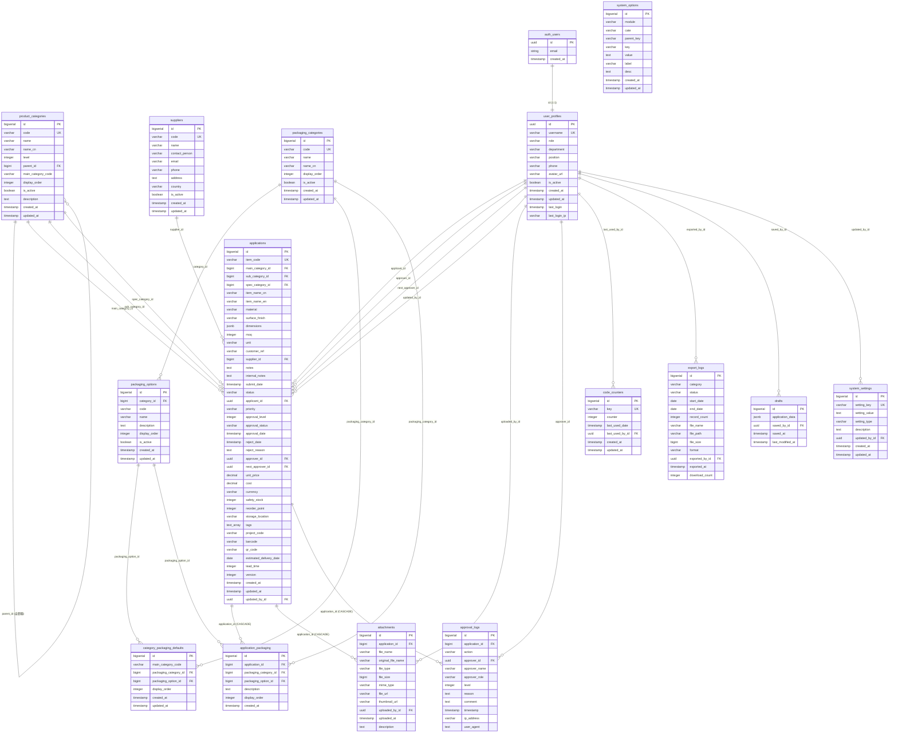

# 資料庫關聯圖

根據 `supabase_schema.sql` 生成的資料庫關聯圖

## 資料表說明

### 核心業務表

1. **applications** - 申請資料表（核心表）
   - 關聯到：product_categories (3個), suppliers, user_profiles (4個)
   - 包含完整的申請資訊

2. **application_packaging** - 申請包裝資料表
   - 關聯到：applications, packaging_categories, packaging_options
   - 儲存申請的包裝選項和說明

3. **attachments** - 附件表
   - 關聯到：applications, user_profiles
   - 儲存申請的附件檔案

4. **approval_logs** - 審核記錄表
   - 關聯到：applications, user_profiles
   - 記錄所有審核動作

### 系統參數表

5. **product_categories** - 產品分類系統
   - 自關聯：parent_id（階層結構）
   - 三層結構：大類 → 中類 → 小類

6. **suppliers** - 供應商表
   - 獨立表，被 applications 引用

7. **packaging_categories** - 包裝類別表
   - 8個包裝類別

8. **packaging_options** - 包裝選項表
   - 關聯到：packaging_categories
   - 各類別下的具體選項

9. **category_packaging_defaults** - 類別預設包裝表
   - 關聯到：packaging_categories, packaging_options
   - 各產品大類的預設包裝選項

10. **system_options** - 系統參數資料表
    - 獨立表，儲存系統設定類的選項

### 使用者與認證表

11. **auth.users** - Supabase 內建使用者表
    - 用於身份驗證

12. **user_profiles** - 使用者資料表
    - 關聯到：auth.users (1:1)
    - 儲存應用程式特定的使用者資料

### 輔助表

13. **code_counters** - 編碼計數器表
    - 關聯到：user_profiles
    - 用於產生料號的流水號計數器

14. **export_logs** - 匯出記錄表
    - 關聯到：user_profiles
    - 記錄 Excel 匯出操作

15. **drafts** - 草稿表
    - 關聯到：user_profiles
    - 儲存未提交的申請草稿

16. **system_settings** - 系統設定表
    - 關聯到：user_profiles
    - 儲存系統設定值

## 關聯關係說明

### 一對多關係 (1:N)
- `product_categories` → `applications` (3個外鍵：main_category_id, sub_category_id, spec_category_id)
- `suppliers` → `applications`
- `user_profiles` → `applications` (4個外鍵：applicant_id, approver_id, next_approver_id, updated_by_id)
- `applications` → `application_packaging` (CASCADE DELETE)
- `applications` → `attachments` (CASCADE DELETE)
- `applications` → `approval_logs` (CASCADE DELETE)
- `packaging_categories` → `packaging_options`
- `packaging_categories` → `category_packaging_defaults`
- `packaging_options` → `category_packaging_defaults`
- `user_profiles` → `attachments`, `approval_logs`, `code_counters`, `export_logs`, `drafts`, `system_settings`

### 一對一關係 (1:1)
- `auth.users` → `user_profiles`

### 自關聯關係
- `product_categories` → `product_categories` (parent_id，階層結構)

## 重要特性

1. **CASCADE DELETE**：刪除申請時自動刪除相關的包裝、附件、審核記錄
2. **UUID 外鍵**：所有使用者相關的外鍵使用 UUID（對應 auth.users.id）
3. **JSONB 欄位**：applications.dimensions 使用 JSONB 儲存複雜結構
4. **階層結構**：product_categories 使用自關聯實現三層階層
5. **唯一約束**：多個表使用複合唯一約束確保資料完整性

